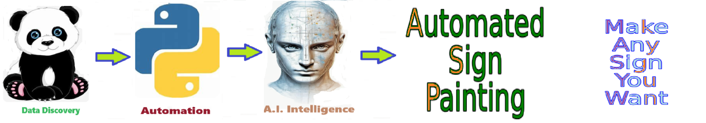

    
# Create Solution Sign 

## A utility to create a new PNG sign for every solution.

    
## 🎨🖌️  Create Solution Sign

The **create_solution_sign** function generates a unique sign for each solution name, ensuring distinct visual representation for every solution.

**Automated sign painting** utilizes computerized systems to create signage with precision and efficiency. These systems can generate signs of any font size or color, allowing for versatility in design. By leveraging automated processes, businesses can produce signage quickly and accurately, saving time and resources. Additionally, the signs are typically saved as .PNG files, ensuring compatibility across various platforms and ease of distribution. This approach streamlines the sign-making process, resulting in high-quality output while minimizing manual labor and errors.

**Matplotlib** is a powerful Python library for creating static, interactive, and animated **visualizations**. It offers a wide range of plotting functionalities, enabling users to generate high-quality graphs, charts, and plots for data analysis and presentation purposes.

##  Create Sign Library

The **Create Sign Library** is named create_sign.py.

import create_sign as cs

## Create Sign Library Functions

Help on module create_sign:

NAME
    create_sign

FUNCTIONS
    create_sign(word, font_size=100, font_color='lime', background_color='black', glow_color='lime')

    create_sign_II(word: str, font_size: int = 120, font_color: str = 'lime', background_color: str = 'black', glow_color: str = 'lime', glow_width: int = 6, pad_px: int = 40, font_path: str | None = None, dpi: int = 200, save_path: str | None = None)
        Render a glowing text 'sign' and optionally save to file.

        Returns:
            (fig, ax) if not saved, else the save_path.

    create_solution_sign(df)

    create_stacked_sign(phrase, font_size=100, font_color='lime', background_color='black', glow_color='lime')
        Split the phrase into individual words

    persist_plt(plt, filename)

FILE
    c:\users\josep\create_solution_sign\create_sign.py

## 🎨🖌️  Create Solution Sign Story Board END TEST 

## 🎨🖌️  Create Solution Sign Story Board End.

The **create_solution_sign** function generates a unique sign for each solution name, ensuring distinct visual representation for every solution.

**Automated sign painting** utilizes computerized systems to create signage with precision and efficiency. These systems can generate signs of any font size or color, allowing for versatility in design. By leveraging automated processes, businesses can produce signage quickly and accurately, saving time and resources. Additionally, the signs are typically saved as .PNG files, ensuring compatibility across various platforms and ease of distribution. This approach streamlines the sign-making process, resulting in high-quality output while minimizing manual labor and errors.

**Matplotlib** is a powerful Python library for creating static, interactive, and animated **visualizations**. It offers a wide range of plotting functionalities, enabling users to generate high-quality graphs, charts, and plots for data analysis and presentation purposes.

 
## 🎨🖌️  Create Solution Sign

The **create_solution_sign** function generates a unique sign for each solution name, ensuring distinct visual representation for every solution.

**Automated sign painting** utilizes computerized systems to create signage with precision and efficiency. These systems can generate signs of any font size or color, allowing for versatility in design. By leveraging automated processes, businesses can produce signage quickly and accurately, saving time and resources. Additionally, the signs are typically saved as .PNG files, ensuring compatibility across various platforms and ease of distribution. This approach streamlines the sign-making process, resulting in high-quality output while minimizing manual labor and errors.

**Matplotlib** is a powerful Python library for creating static, interactive, and animated **visualizations**. It offers a wide range of plotting functionalities, enabling users to generate high-quality graphs, charts, and plots for data analysis and presentation purposes.

##  Create Sign Library

The **Create Sign Library** is named create_sign.py.

import create_sign as cs

## Create Sign Library Functions

Help on module create_sign:

NAME
    create_sign

FUNCTIONS
    create_sign(word, font_size=100, font_color='lime', background_color='black', glow_color='lime')

    create_sign_II(word: str, font_size: int = 120, font_color: str = 'lime', background_color: str = 'black', glow_color: str = 'lime', glow_width: int = 6, pad_px: int = 40, font_path: str | None = None, dpi: int = 200, save_path: str | None = None)
        Render a glowing text 'sign' and optionally save to file.

        Returns:
            (fig, ax) if not saved, else the save_path.

    create_solution_sign(df)

    create_stacked_sign(phrase, font_size=100, font_color='lime', background_color='black', glow_color='lime')
        Split the phrase into individual words

    persist_plt(plt, filename)

FILE
    c:\users\josep\create_solution_sign\create_sign.py

## 🎨🖌️  Create Solution Sign Story Board END TEST 

## 🎨🖌️  Create Solution Sign Story Board End.

 

## Getting Started

The goal of this solution is to **Jump Start** your development and have you up and running in 30 minutes. 

To get started with the **Create Solution Sign** solution repository, follow these steps:
1. Clone the repository to your local machine.
2. Install the required dependencies listed at the top of the notebook.
3. Explore the example code provided in the repository and experiment.
4. Run the notebook and make it your own - **EASY !**
    
## 🧠 Solution Features

- ✅ Easy to understand and use  
- ✅ Easily Configurable 
- ✅ Quickly start your project with pre-built templates
- ✅ Its Fast and Automated
- ✅ Saves You Time 

## ⚙️ Key Features

- ✅ **Self Documenting** Automatically identifies and annotates major steps in a notebook, making the codebase readable and well structured.
- ✅ **Self Testing** Includes built in **unit tests** for each function to validate logic and ensure code reliability.
- ✅ **Easily Configurable** Uses a simple **config.ini** file for centralized settings and easy customization through key value pairs.
- ✅ **Talking Code** explains itself through inline commentary, helping you understand both **what** it does and **why** it does it.
- ✅ **Self Logging** extends Python’s standard **logging** module for **step by step runtime insights**.
- ✅ **Self Debugging** Includes debugging hooks and detailed error tracing to simplify development and troubleshooting.
- ✅ **Low Code or  No Code** Designed to minimize complexity — most full solutions are under 50 lines of code.
- ✅ **Educational** Each template includes educational narrative and background context to support learning, teaching, and collaborative development.

    